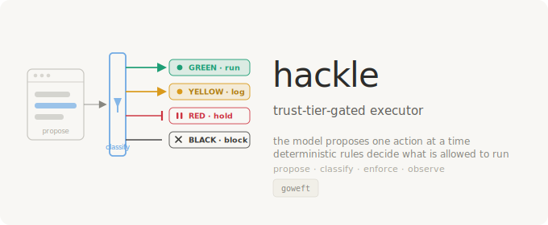
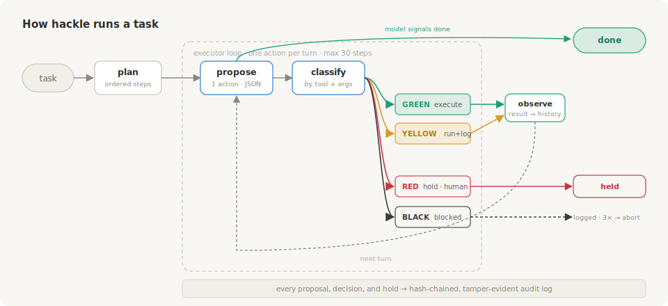

<p align="center"></p>

<h1 align="center">hackle</h1>
<p align="center"><strong>Trust-tier-gated executor agent</strong></p>
<p align="center">
  A local model proposes one action at a time; deterministic rules you control decide what runs.<br>
  Four tiers &nbsp;·&nbsp; fail-closed &nbsp;·&nbsp; hash-chained audit &nbsp;·&nbsp; no network
</p>

<p align="center">
  <a href="#what-it-is">What It Is</a> &nbsp;·&nbsp;
  <a href="#trust-tiers">Trust Tiers</a> &nbsp;·&nbsp;
  <a href="#reliability">Reliability</a> &nbsp;·&nbsp;
  <a href="#how-it-works">How It Works</a> &nbsp;·&nbsp;
  <a href="#quickstart">Quick Start</a>
</p>

<p align="center">
  <a href="LICENSE"></a>
  
  
</p>

---

## What it is

AI coding agents are useful right up until they do the thing you didn't want — delete the wrong directory, push to the wrong remote, read a secret they had no business touching. The usual options are to trust the model completely or babysit every step.

hackle takes a third path. The model only ever *proposes* one action at a time. Before anything happens, a deterministic classifier — plain Python the model can't see or influence — sorts that action into **GREEN** (runs), **YELLOW** (runs and is logged), **RED** (stops and waits for you), or **BLACK** (never runs). The model does the thinking; you keep the authority. Every proposal, decision, and hold lands in a tamper-evident log, there's no network access, and everything is confined to a sandbox directory you choose.

## Trust tiers

Every proposed action is classified into one of four tiers. The tier is decided by inspecting the concrete tool and its arguments — not by asking the model what it intends.

| Tier   | Meaning                                  | What the loop does                                  |
|--------|------------------------------------------|-----------------------------------------------------|
| GREEN  | Safe, read-only or trivially reversible  | Executes immediately                                |
| YELLOW | Scoped write inside the jail             | Executes immediately, audited                       |
| RED    | Needs a human                            | Held — raises `EscalationHold`; the run stops and reports the held action |
| BLACK  | Disallowed                               | Never runs                                          |

The classifier is constructed with a jail root, a deny-glob list (`.env*`, `*.pem`, `*.key`, `.ssh/**`, `credentials*`, `.git/**`), a git subcommand allowlist, and a shell allowlist/denylist. Anything it can't classify fails closed.

## Reliability

Single-step proposal validity is a solved problem — constrained JSON decoding gets a small local model to emit a valid action. The hard part is multi-step reliability: models fixate on the `git add` → `git commit` transition and stall.

hackle's fix is structural. `ToolRunner` stages exactly the paths it wrote or deleted this run when the model commits, so the model never has to drive `git add` at all, and a commit can't sweep in unrelated untracked files.

Measured with the included harness against a live `qwen3-coder:30b`, four tasks run three times each (12 runs total), autostage enabled:

| Task              | done | commit |
|-------------------|------|--------|
| read_write_commit | 3/3  | 3/3    |
| create_commit     | 3/3  | 3/3    |
| two_files_commit  | 3/3  | 3/3    |
| delete_commit     | 3/3  | 3/3    |

12/12 done-rate, 12/12 commit-rate: every run completed the intended change *and* landed it in a commit. Reproduce with `python scripts/reliability.py --arms structural --runs 3` (needs a running Ollama at `localhost:11434`). The harness also ships a `manual` baseline arm to A/B the autostage fix.

## Quickstart

```bash
pip install -e .

# Dry run — narrates the mutations it would make, runs nothing
hackle --jail ./demo/sandbox --dry-run --task "Create a file notes.md and commit it"

# Live run against a local Ollama model
hackle --jail ./demo/sandbox --task-file ./demo/sample_task.txt
```

`--jail` is required: it is the sandbox root, resolved to a real path, and every tool action is confined to it. The task comes from `--task`, then `--task-file`, then stdin (first match wins). `--model` defaults to `qwen3-coder:30b`. Exit codes: `0` task done, `1` error or not done, `2` held for approval.

## How it works

<p align="center"></p>

```
plan → propose → classify → enforce → observe → (repeat)
```

1. A planning pass turns the task into a short plan.
2. Each turn, the loop model proposes exactly one action as JSON (constrained decoding forces valid output from small models).
3. The classifier assigns a tier from the concrete tool and arguments.
4. The loop enforces the tier: GREEN/YELLOW run, RED is held, BLACK is blocked. A run with no approval channel treats RED as a hard stop.
5. Every call, denial, and hold is written to a hash-chained, tamper-evident audit log.

There are four tools, all confined to the jail: `read_file`, `write_file`, `git_ops`, and `shell_exec`. Shell binaries are allowlisted; anything outside the allowlist classifies RED or BLACK.

## Where this came from

hackle is the standalone executor core extracted from a larger private MCP-mesh runtime. Here it stands alone: a CLI and an importable library, no external services required beyond a local model endpoint.

## License

Apache-2.0. Copyright 2026 goweft.
